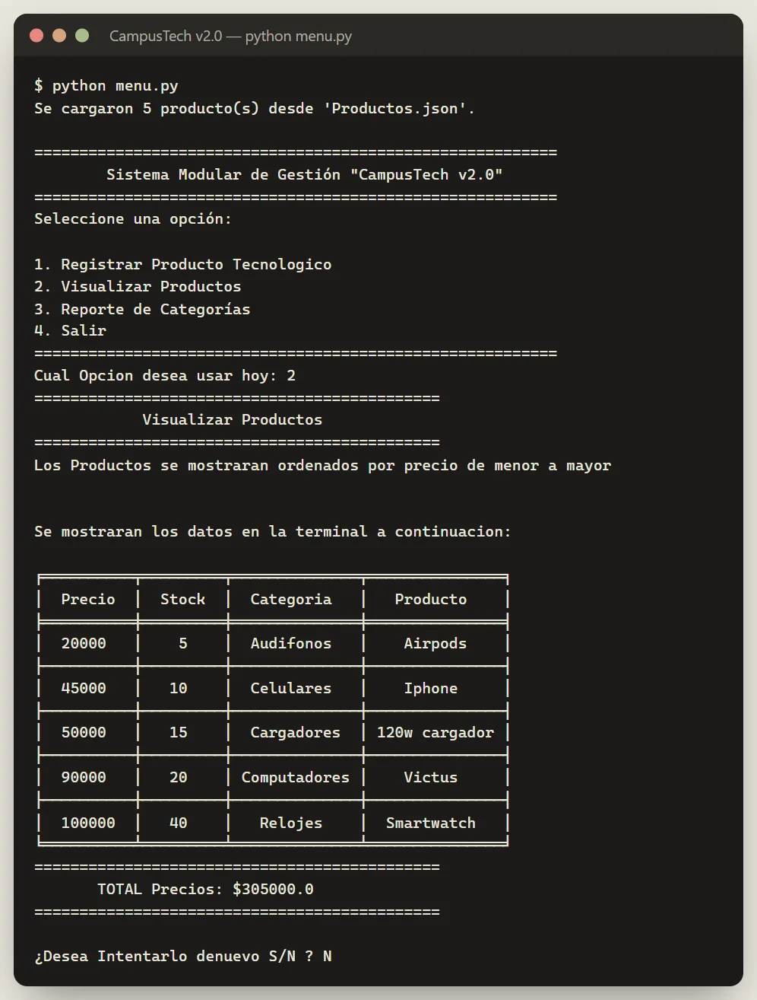
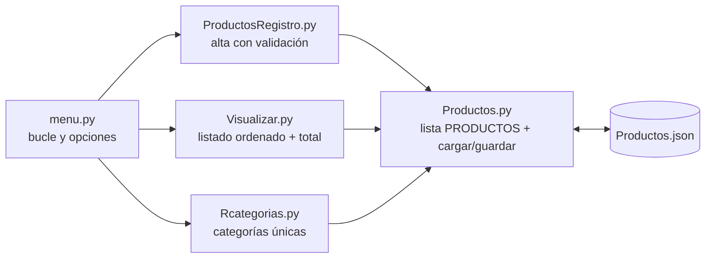

# CampusTech v2.0 — inventario tecnológico modular

Sistema de gestión de inventario por consola, escrito en **Python** y repartido en módulos con una sola responsabilidad cada uno. Registra productos tecnológicos con validación, los lista ordenados por precio, agrupa las categorías y guarda todo en **JSON** entre ejecuciones.




## El problema

Llevar un inventario de productos tecnológicos a mano genera datos inconsistentes y sin trazabilidad: no hay forma rápida de registrar, consultar ni agrupar el stock por categoría. La primera versión del sistema funcionaba, pero era un único archivo monolítico difícil de mantener. La v2.0 es su reescritura modular.

## Tecnologías

| Tecnología | Para qué se usa |
| :--- | :--- |
| **Python 3** | Lógica del menú, registro, validación, ordenamiento y reportes. |
| **JSON** (`json`, `os`) | Persistencia del inventario en `Productos.json`, con recuperación si el archivo está corrupto. |
| **tabulate** | Tablas con formato `fancy_grid` en la terminal. |

## Funciones clave

- **Menú principal** en bucle con 4 opciones, tolerante a entradas no numéricas.
- **Registro de productos:** precio y stock positivos, categoría y nombre normalizados, y confirmación explícita antes de añadirlo.
- **Visualización** de todos los productos ordenados por precio de menor a mayor (ordenamiento burbuja implementado a mano), con el total de precios.
- **Reporte de categorías:** lista de categorías únicas presentes en el inventario.
- **Persistencia opcional:** al salir pregunta si guardar los cambios en `Productos.json`. Al arrancar carga los datos existentes y, si el JSON está dañado, empieza con una lista vacía en lugar de fallar.

## Evidencias

Salida real del programa con los datos de ejemplo de `Productos.json`:

```text
Cual Opcion desea usar hoy: 3
=============================================
          Reporte de Categorías
=============================================

╒════════════════════════╕
│  Categorías Presentes  │
╞════════════════════════╡
│       Cargadores       │
├────────────────────────┤
│      Computadores      │
├────────────────────────┤
│       Celulares        │
├────────────────────────┤
│       Audifonos        │
├────────────────────────┤
│        Relojes         │
╘════════════════════════╛
```

### Arquitectura de módulos



## Instalación y uso

Requiere Python 3 y la librería `tabulate`:

```bash
git clone https://github.com/Eidan210/CampusTech-V2.0-Eidan.git
cd CampusTech-V2.0-Eidan
pip install tabulate
python menu.py
```

```text
CampusTech-V2.0-Eidan/
├── menu.py               # Punto de entrada: menú principal
├── ProductosRegistro.py  # Registro de productos con validación
├── Visualizar.py         # Listado ordenado por precio y total
├── Rcategorias.py        # Reporte de categorías
├── Productos.py          # Datos en memoria y persistencia JSON
└── Productos.json        # Inventario de ejemplo
```

## Aprendizajes

- **Refactorizar algo que ya funciona:** pasar de un script monolítico a cinco módulos con una responsabilidad cada uno, de modo que cambiar la persistencia solo toca `Productos.py`.
- **Validar la entrada del usuario** en el borde del sistema: tipos, valores positivos, opciones S/N y manejo de `ValueError`.
- **Persistir y recuperar datos** con `json`, cubriendo el caso del archivo corrupto.
- **Implementar un algoritmo clásico** (ordenamiento burbuja) en lugar de delegarlo en `sorted()`, para entender qué hace por dentro.
- **Presentar datos en consola** de forma legible con `tabulate`.

---

Desarrollado por **Eidan Alexander Carreño** ([@Eidan210](https://github.com/Eidan210)) · Campuslands.
